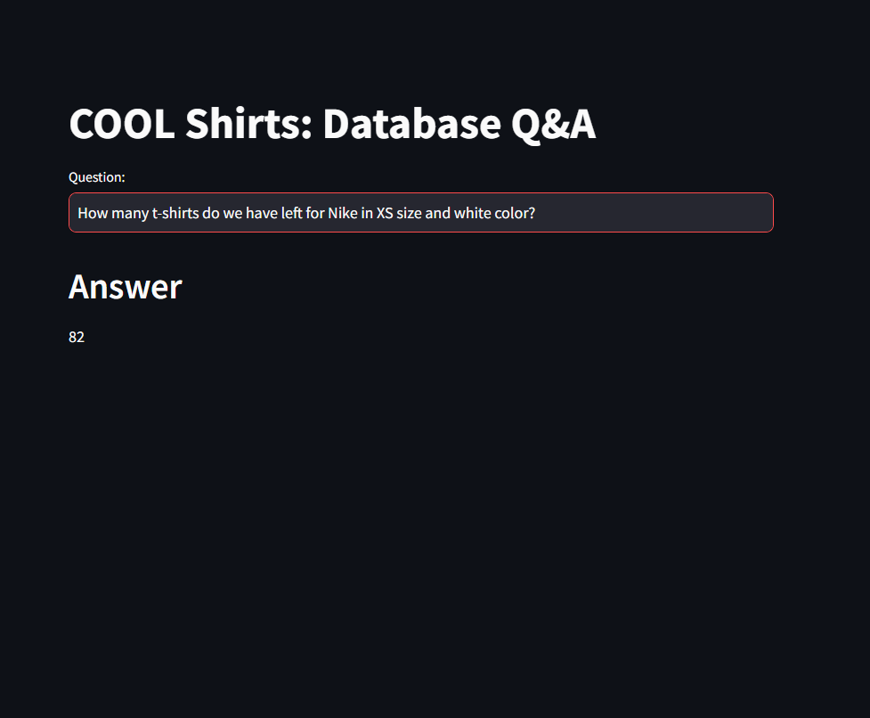

# talk-with-database
Ask questions to your sql database

This Project uses <a href="https://python.langchain.com/docs/integrations/chat/google_generative_ai/" target="_blank">langchain_google_genai</a> to convert user questions into SQL queries, this sql query is passed to the sql database and finally the obtained answer is displayed to the user.

### To Do
Give more few shot samples  
Fix `SQLDatabaseChain` Output Formatting

### Output

